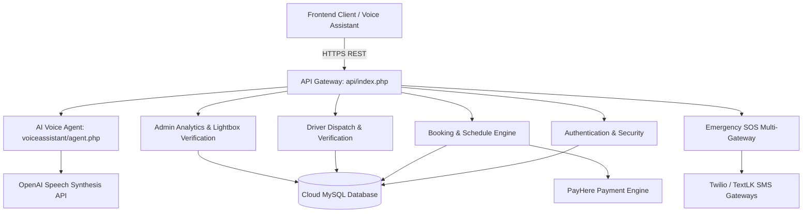

# <p align="center">⚙️ AccessRide Backend API</p>

<p align="center">
  <strong>High-Performance RESTful Serverless API & Microservices for AccessRide</strong>
</p>

<p align="center">
  
  
  
  
  
  
</p>

---

## 🌟 Architecture Overview

The **AccessRide Backend** is a modular, high-performance PHP RESTful API designed for serverless cloud execution (Vercel Serverless Functions) and standard Apache/Nginx hosting. It handles role-based access control, ride dispatching, payment verification, multi-channel emergency SMS notifications, and AI-driven voice interactions.



---

## 🎙️ AI Voice Assistant Architecture & Backend Pipeline

The backend powers an intelligent conversational voice interface tailored for accessibility:

1. **Text-to-Speech Streaming (`/voiceassistant/agent.php?action=speak`)**:
   - Interfaces directly with OpenAI's `tts-1` high-definition audio model.
   - Generates natural, human-like voice responses on the fly.
   - Streams cached MP3 audio directly to the frontend with zero lag.

2. **Rider Home Location Geocoding (`/voiceassistant/agent.php?action=get_user_location`)**:
   - Securely queries the rider's saved home/pickup address from the database.
   - Enables hands-free commands like *"Take me home"* or *"Pick me up from my address"*.

3. **Multi-Step Conversation Engine**:
   - Resolves spoken locations to coordinates via reverse geocoding.
   - Handles natural date/time resolution (e.g., *"tomorrow at 3 PM"*).
   - Validates ride confirmations and vehicle selection hands-free.

---

## 🚀 Key Modules & Capabilities

### 🔐 1. Authentication & Security (`/login`)
- **Bcrypt Password Security**: Robust `password_hash()` encryption.
- **Dynamic Port & Connection Handler**: PDO connection management supporting custom cloud database ports with automatic timeout safeguards.
- **Unified Credential Responses**: Secure, standardized `"Username or password is invalid"` responses to prevent account enumeration.
- **Driver Verification Documents**: Multi-file upload handlers for Driving Licenses, National Identity Cards (NIC), Vehicle Registration, and Vehicle Inspection photos.

### 🚨 2. Multi-Gateway Emergency SOS (`/Emergency`)
- Instant dispatch of Emergency SOS SMS alerts to registered guardians.
- Delivers rider identity, vehicle plate numbers, and live GPS map tracking URLs via Twilio, TextLK, and Telnyx failover channels.

### 🚖 3. Driver & Ride Dispatch (`/Driverdashboard` & `/UserDashboard`)
- Real-time ride request broadcasting to nearest available drivers.
- Dynamic fare estimation based on route distance and vehicle category.
- Scheduled and advance ride management.

### 🛡️ 4. Admin Management & Document Verification (`/admin`)
- Relational SQL queries linking driver accounts with submitted verification documents for full-resolution admin review.
- Automated monthly growth statistics, revenue aggregation, and driver subscription audits.

---

## 🗄️ Database Architecture

Key relational tables configured in `database/accessride.sql`:

| Table Name | Description | Key Fields |
| :--- | :--- | :--- |
| `users` | Rider accounts & saved locations | `first_name`, `last_name`, `email`, `phone`, `location`, `address`, `password_hash` |
| `drivers` | Driver profiles & vehicle details | `name`, `email`, `phone`, `license_number`, `vehicle_number`, `vehicle_type`, `status` |
| `driver_documents`| Verification certificates & photos | `license_front`, `license_back`, `nic_front`, `nic_back`, `registration_image`, `vehicle_front` |
| `rides` | Ride bookings & trips | `user_id`, `driver_id`, `pickup_location`, `dropoff_location`, `fare`, `status`, `scheduled_at` |
| `emergency_contacts`| Rider guardians for SOS | `user_id`, `contact_name`, `phone_number`, `relationship` |
| `admins` | Administrative users | `name`, `email`, `password` |

---

## 📁 Directory Structure

```bash
backend/
├── admin/                  # Admin API endpoints & models (Drivers, Users, Reports, Analytics)
├── api/
│   └── index.php           # Primary Vercel Serverless router & universal CORS engine
├── database/
│   └── accessride.sql      # Database schema & migrations
├── Driverdashboard/        # Driver portal API endpoints & Database connection class
├── Emergency/              # Emergency SOS dispatcher & SMS triggers
├── history_and_profile/    # User ride history, receipts, and profile APIs
├── login/                  # Auth controllers, models (User, Driver, Admin) & upload handler
│   ├── api/                # login.php, register.php, driver_login.php, driver_register.php
│   ├── models/             # User.php, Driver.php, Admin.php (PDO Connection classes)
│   └── uploads/            # Document directories (licenses, nic, registration, vehicle)
├── UserDashboard/          # Booking, schedule advance rides, vehicle search APIs
├── voiceassistant/         # AI Voice speech agent & geocoding (agent.php)
├── .env.example            # Environment variable template
└── vercel.json             # Vercel Serverless deployment configuration
```

---

## 🛠️ Environment Configuration

Copy `.env.example` to `.env` and fill in your credentials:

```env
# Application Base URLs
BACKEND_BASE=your_backend_url_here
FRONTEND_BASE=your_frontend_url_here

# Database Configuration (Cloud MySQL)
DB_HOST=your_database_host_here
DB_PORT=your_database_port_here
DB_NAME=your_database_name_here
DB_USER=your_database_user_here
DB_PASS=your_database_password_here

# OpenAI API (For AI Voice Engine)
OPENAI_API_KEY=your_openai_api_key_here

# SMS & SOS Gateways
TWILIO_SID=your_twilio_sid_here
TWILIO_TOKEN=your_twilio_token_here
TWILIO_FROM=your_twilio_phone_number_here
TEXTLK_API_KEY=your_textlk_api_key_here
TEXTLK_SENDER_ID=your_sender_id_here

# Mapbox API (Geocoding)
MAPBOX_TOKEN=your_mapbox_token_here

# PayHere Payment Gateway
PAYHERE_MERCHANT_ID=your_merchant_id_here
PAYHERE_SECRET=your_payhere_secret_here
PAYHERE_SANDBOX=true
```

---

## 👥 Contributors & Team Members

<table align="center">
  <tr>
    <td align="center" width="25%">
      <a href="https://github.com/quintusjonath-jemy">
        
        <br />
        <sub><b>Quintus Jonath</b></sub>
      </a>
      <br />
      <span style="font-size:12px;color:#888;">Lead Developer</span>
    </td>
    <td align="center" width="25%">
      <a href="https://github.com/kabil0507">
        
        <br />
        <sub><b>Kabilan</b></sub>
      </a>
      <br />
      <span style="font-size:12px;color:#888;">Full-Stack Developer</span>
    </td>
    <td align="center" width="25%">
      <a href="https://github.com/KRITHIKA3006">
        
        <br />
        <sub><b>Krithika</b></sub>
      </a>
      <br />
      <span style="font-size:12px;color:#888;">Developer & UI/UX</span>
    </td>
    <td align="center" width="25%">
      <a href="https://github.com/nithan11">
        
        <br />
        <sub><b>Nithan</b></sub>
      </a>
      <br />
      <span style="font-size:12px;color:#888;">Developer & QA</span>
    </td>
  </tr>
</table>

---

<p align="center">
  Made with ❤️ by the AccessRide Team
</p>
